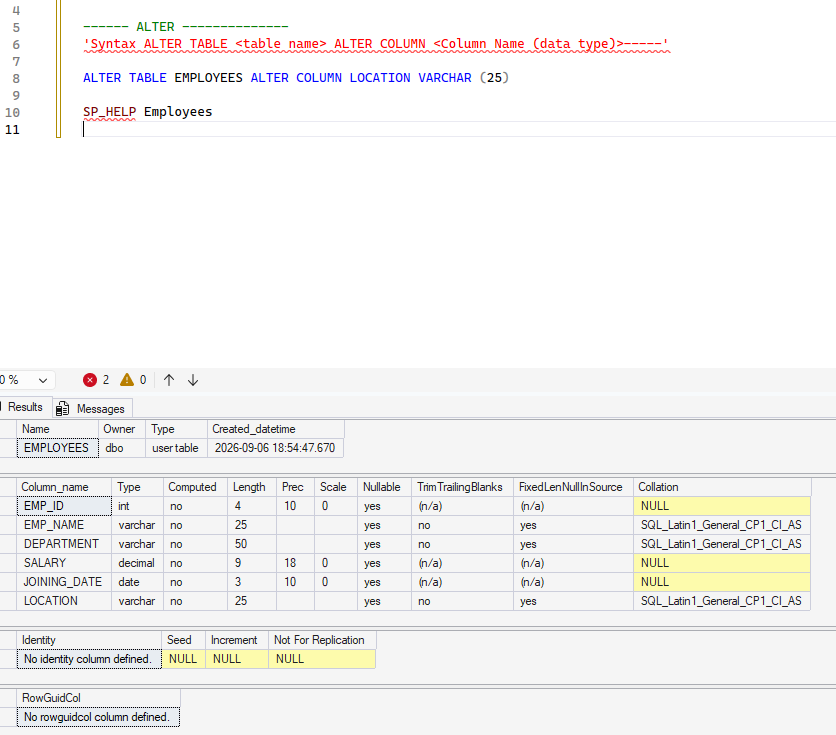

# 🏗️ SQL DDL - Data Definition Language

## 📌 Project Overview

This project demonstrates my practical understanding of SQL Data Definition Language (DDL) using an Employee Management business scenario.

The objective is to understand how database structures are created, modified and removed using Microsoft SQL Server.

---

## 🏢 Business Scenario

A company wants to maintain employee information in a structured database.

The HR department needs to store:

| Field | Business Purpose |
|---|---|
| EMP_ID | Unique employee identifier |
| EMP_NAME | Employee name |
| DEPARTMENT | Employee department |
| DESIGNATION | Employee job role |
| SALARY | Employee salary |
| JOINING_DATE | Employee joining date |

---

## 🎯 Business Requirement

The organization needs an Employee table that can be:

1. Created when the system is introduced
2. Modified when business requirements change
3. Cleared when temporary data needs to be removed
4. Deleted when the table is no longer required

---

## 📚 DDL Commands Covered

| Command | Purpose | Business Example |
|---|---|---|
| CREATE | Creates a database object | Create Employee table |
| ALTER | Modifies an existing object | Add employee email |
| TRUNCATE | Removes all records | Clear temporary employee data |
| DROP | Removes a database object | Remove obsolete table |

---

---

## 💼 Practical Demonstration

This project demonstrates how SQL DDL commands can be applied to real-world business requirements.

### Scenario 1: Create Employee Structure

**Business Requirement:**

The HR department requires a structured table to store employee information.

**SQL Solution:**

`CREATE TABLE`

The Employee table is created with fields such as Employee ID, Employee Name, Department, Salary and Joining Date.

---

### Scenario 2: Modify Employee Structure

**Business Requirement:**

HR later requires changes to the employee database structure.

**SQL Solution:**

`ALTER TABLE`

Examples demonstrated:

- Modify an existing column using `ALTER COLUMN`
- Add a new column using `ADD`

Example:

```sql
ALTER TABLE EMPLOYEES
ADD DESIGNATION VARCHAR(25);

## 🛠️ Technology

- Microsoft SQL Server
- T-SQL
- SQL Server Management Studio
- GitHub

---

## 📂 Project Files

| File | Description |
|---|---|
| `01_CREATE.sql` | Creates database and Employee table |
| `02_ALTER.sql` | Modifies Employee table |
| `03_TRUNCATE.sql` | Removes all records |
| `04_DROP.sql` | Removes Employee table |

---

## 💻 SQL Concepts Demonstrated

- CREATE DATABASE
- CREATE TABLE
- ALTER TABLE
- TRUNCATE TABLE
- DROP TABLE
- SQL Data Types
- Database Object Management

---

## 💡 Key Learning

Through this project, I learned how DDL commands are used to manage the structure and lifecycle of database objects in Microsoft SQL Server.

I also learned how technical SQL concepts can be connected to real-world business requirements.

---

## 🎤 Interview Questions Practiced

1. What is DDL?
2. What is the difference between DELETE and TRUNCATE?
3. What is the difference between DROP and TRUNCATE?
4. What is the purpose of ALTER TABLE?
5. What happens when a table is dropped?
6. What is the difference between CREATE TABLE and ALTER TABLE?

---

## 🚀 Next Topic

**DML - Data Manipulation Language**

Topics:

- INSERT
- UPDATE
- DELETE
---

## 📸 SQL Execution Evidence

The following screenshot shows the successful execution of the Employee table creation and the resulting table structure in Microsoft SQL Server.


---

## 📸 ALTER TABLE Execution Evidence

The following screenshot demonstrates the successful execution of ALTER TABLE commands in Microsoft SQL Server.

The exercise covers:

- Modifying an existing column using `ALTER COLUMN`
- Adding a new column using `ADD`


---

## 📸 SQL Server Execution Evidence

### CREATE TABLE

The screenshot below demonstrates the successful creation of the Employee table in Microsoft SQL Server.


---

### ALTER TABLE

The screenshot below demonstrates the successful modification of the Employee table using ALTER TABLE.

The exercise covers:

- Modifying an existing column using ALTER COLUMN
- Adding a new column using ADD



---

## 🎯 Business Learning

This exercise helped me understand how database structures can be created and modified based on changing business requirements.

### Example

**Business Requirement:**

HR wants to capture additional employee information.

**SQL Solution:**

```sql
ALTER TABLE EMPLOYEES
ADD DESIGNATION VARCHAR(25);


🚀 SQL Learning Journey

Business Analyst | SQL | Data Analytics

━━━━━━━━━━━━━━━━━━━━━━━━━━━━

🎯 About This Portfolio

---

## 📌 Portfolio Status

| Topic | Status |
|---|---|
| SQL Server Introduction | ✅ Completed |
| Data Types | ✅ Completed |
| DDL | ✅ Completed |
| DML | 🔄 In Progress |
| Operators | ⏳ Upcoming |
| Functions | ⏳ Upcoming |
| Joins | ⏳ Upcoming |
| Subqueries | ⏳ Upcoming |
| CTE | ⏳ Upcoming |
| Ranking Functions | ⏳ Upcoming |

━━━━━━━━━━━━━━━━━━━━━━━━━━━━

📚 SQL Skills

DDL       ✅
DML       ⬜
Operators ⬜
Functions ⬜
Joins     ⬜
...

━━━━━━━━━━━━━━━━━━━━━━━━━━━━

⭐ Featured Projects

Employee Analytics
Sales Analytics
Customer Analytics

━━━━━━━━━━━━━━━━━━━━━━━━━━━━

📂 Learning Modules

01 DDL
02 DML
03 Operators
...

━━━━━━━━━━━━━━━━━━━━━━━━━━━━

🌱 1% Better Than Yesterday
