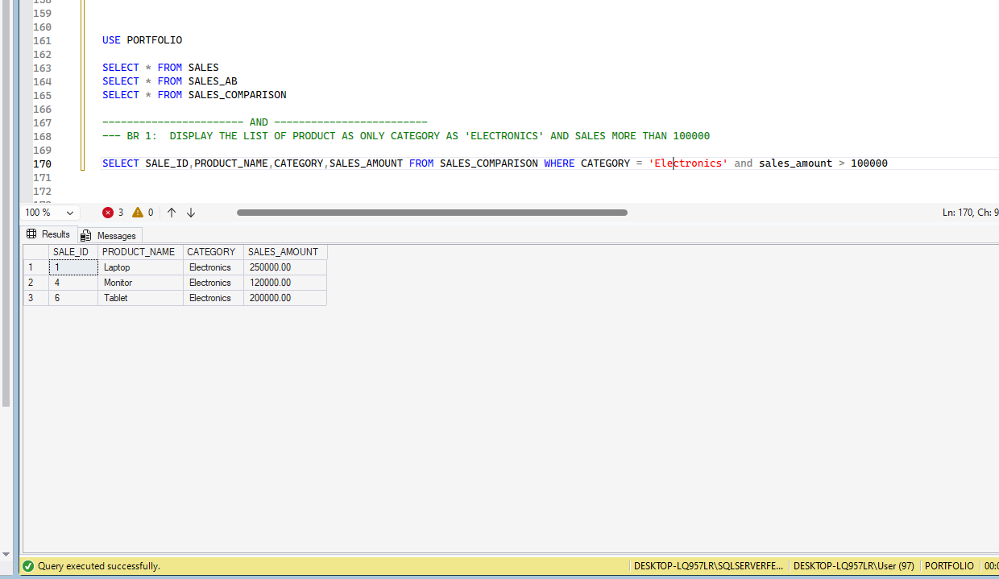
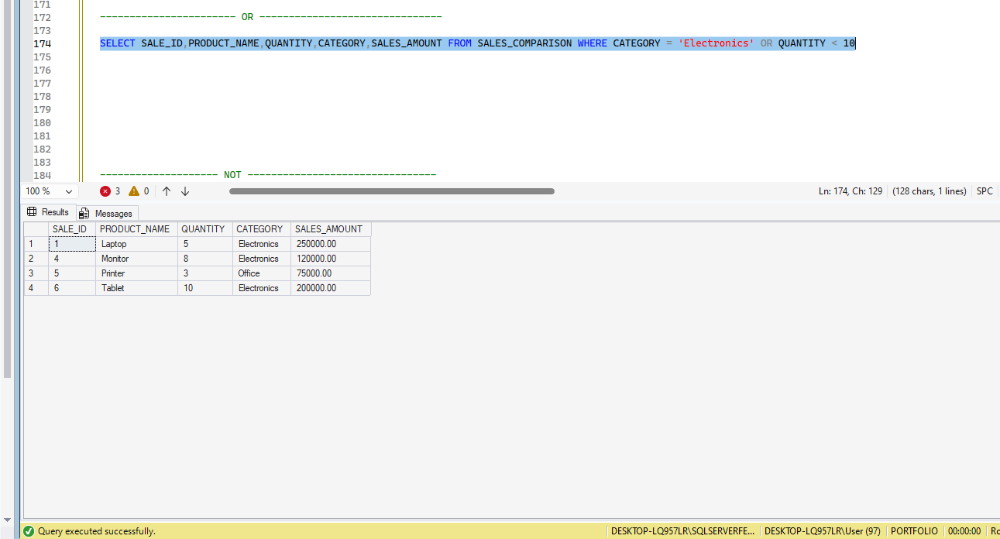
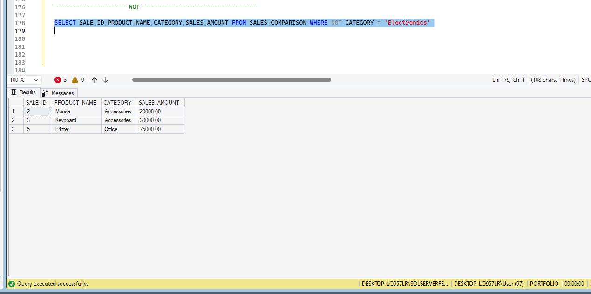

# 🏥 Hospital Patient Management System

## SQL Logical Operators – Real-World Business Scenarios


---

## 📌 1. Project Overview

This module demonstrates the practical application of **SQL Logical Operators** using the Hospital Patient Management System developed in Microsoft SQL Server.

Logical Operators are used to combine multiple conditions in a SQL query and retrieve records that satisfy specific business requirements.

### 🎯 Learning Objectives

- Understand SQL Logical Operators.
- Combine multiple conditions using `AND`, `OR`, and `NOT`.
- Apply logical conditions to hospital billing scenarios.
- Retrieve meaningful business information using SQL queries.

---

## 🏥 2. Business Scenarios

| Operator | Hospital Business Scenario |
|---|---|
| AND | Identify high-value bills that are fully paid. |
| OR | Identify bills that are pending or partially paid. |
| NOT | Identify bills whose payment status is not Paid. |

---

## 💻 3. SQL Scripts

### 01. AND Operator

**Business Requirement:** Identify bills where the total amount is greater than ₹1,500 AND the payment status is Paid.

[View AND SQL Script](./01_AND.sql)

**Expected logic:** Both conditions must be TRUE.

**Execution Evidence:**



---

### 02. OR Operator

**Business Requirement:** Identify bills where the payment status is Pending OR Partially Paid.

[View OR SQL Script](./02_OR.sql)

**Expected logic:** At least one condition must be TRUE.

**Execution Evidence:**



---

### 03. NOT Operator

**Business Requirement:** Identify bills where the payment status is NOT Paid.

[View NOT SQL Script](./03_NOT.sql)

**Expected logic:** Returns records that do not satisfy the specified condition.

**Execution Evidence:**



---

## 📂 4. Project Folder Structure

```text
06_Logical_Operators/
│
├── Execution_Evidence/
│   ├── 01_AND_Result.PNG
│   ├── 02_OR_Result.PNG
│   └── 03_NOT_Result.PNG
│
├── 01_AND.sql
├── 02_OR.sql
├── 03_NOT.sql
└── README.md
```

---

## 📚 5. Key Learning Summary

| Operator | Purpose |
|---|---|
| AND | All conditions must be TRUE. |
| OR | At least one condition must be TRUE. |
| NOT | Reverses a condition's logical result. |

---

## 🚀 6. Hands-On Learning

**Database:** PRJ_Hospital_Patient_Management  
**Table:** dbo.Bill  
**Tool:** Microsoft SQL Server Management Studio (SSMS)

All examples use hospital billing data to demonstrate how logical operators support real-world business reporting and analysis.

---

## 🌱 7. Learning Philosophy

**1% Better Than Yesterday**

Keep Learning. Keep Growing.

Every SQL query is another step towards becoming a confident SQL professional.
