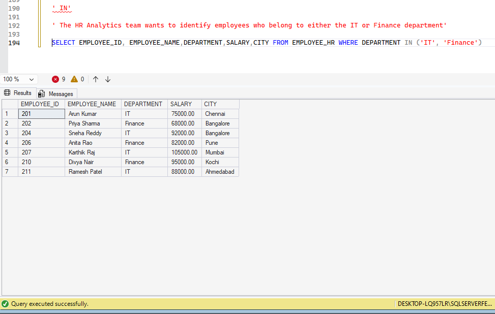
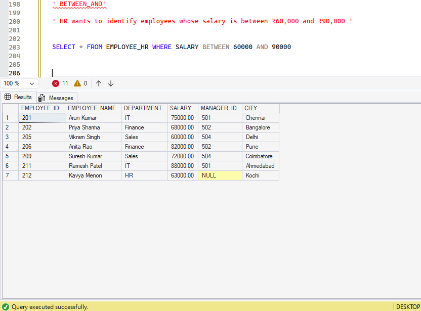
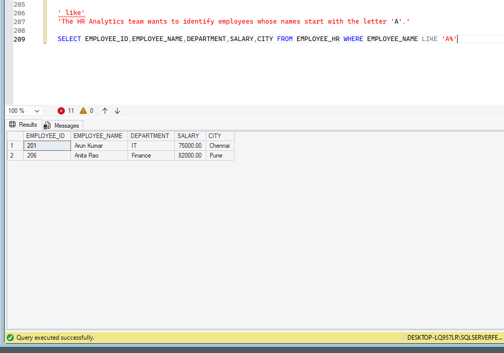
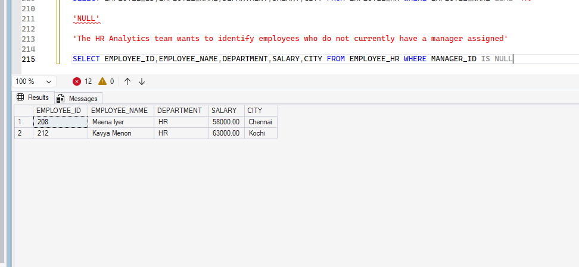

# 🏥 Hospital Patient Management System

## SQL Special Operators – Real-World Business Scenarios


---

## 📌 1. Project Overview

This module demonstrates the practical application of SQL Special Operators using the **Hospital Patient Management System** developed in Microsoft SQL Server.

Special Operators help retrieve specific records by matching values, filtering ranges, searching text patterns, and identifying missing or available information.

### 🎯 Learning Objectives

- Understand the purpose of SQL Special Operators.
- Filter records using the IN operator.
- Retrieve values within a specified range using BETWEEN AND.
- Search text patterns using LIKE.
- Identify missing information using IS NULL.
- Identify available information using IS NOT NULL.
- Apply these concepts to real-world hospital business scenarios.

---

## 🏥 2. Special Operators Covered

| # | Operator | Purpose |
|---|---|---|
| 1 | `IN` | Filter records matching multiple specified values. |
| 2 | `BETWEEN ... AND` | Filter values within a specified range. |
| 3 | `LIKE` | Search for values matching a text pattern. |
| 4 | `IS NULL` | Identify missing or NULL values. |
| 5 | `IS NOT NULL` | Identify values that are not NULL. |

---

## 💻 3. SQL Scripts and Business Scenarios

### 01. IN Operator

**Business Area:** Patient Management

**Business Scenario:** Patient City Analysis

**Business Requirement:** Retrieve patients registered in Bengaluru, Chennai, and Mysuru.

**Business Objective:** Generate a consolidated patient list for selected cities.

**SQL Script:** [01_IN.sql](./01_IN.sql)

**SQL Syntax:**

```sql
SELECT
    Patient_ID,
    Patient_Name,
    Gender,
    City
FROM dbo.Patient
WHERE City IN ('Bengaluru', 'Chennai', 'Mysuru');
```

**Execution Evidence:**



---

### 02. BETWEEN ... AND Operator

**Business Area:** Hospital Billing and Finance

**Business Scenario:** Billing Amount Analysis

**Business Requirement:** Retrieve patient bills with a total amount between ₹1,000 and ₹3,000.

**Business Objective:** Identify bills within the selected financial range.

**SQL Script:** [02_BETWEEN_AND.sql](./02_BETWEEN_AND.sql)

**SQL Syntax:**

```sql
SELECT
    Bill_ID,
    Patient_ID,
    Bill_Date,
    Total_Amount,
    Payment_Status
FROM dbo.Bill
WHERE Total_Amount BETWEEN 1000 AND 3000;
```

**Key Learning:** BETWEEN includes both the starting and ending values.

**Execution Evidence:**



---

### 03. LIKE Operator

**Business Area:** Patient Management

**Business Scenario:** Patient Name Search

**Business Requirement:** Retrieve patients whose names start with the letter A.

**Business Objective:** Help hospital receptionists identify patient records using partial name information.

**SQL Script:** [03_LIKE.sql](./03_LIKE.sql)

**SQL Syntax:**

```sql
SELECT
    Patient_ID,
    Patient_Name,
    Gender,
    City
FROM dbo.Patient
WHERE Patient_Name LIKE 'A%';
```

**Important Wildcards:**

| Wildcard | Purpose | Example |
|---|---|---|
| `%` | Matches zero or more characters. | `'A%'` |
| `_` | Matches exactly one character. | `'R_han'` |

**Execution Evidence:**



---

### 04. IS NULL Predicate

**Business Area:** Patient Management

**Business Scenario:** Missing Patient Contact Information

**Business Requirement:** Identify patients whose phone numbers have not been recorded.

**Business Objective:** Generate a list of patients who need to update their contact information.

**SQL Script:** [04_IS_NULL.sql](./04_IS_NULL.sql)

**SQL Syntax:**

```sql
SELECT
    Patient_ID,
    Patient_Name,
    Gender,
    City,
    Phone
FROM dbo.Patient
WHERE Phone IS NULL;
```

**Key Learning:** IS NULL identifies records containing missing or unknown values.

**Execution Evidence:**



---

### 05. IS NOT NULL Predicate

**Business Area:** Patient Management

**Business Scenario:** Available Patient Contact Information

**Business Requirement:** Identify patients whose phone numbers are available in the database.

**Business Objective:** Generate a list of patients with recorded contact information.

**SQL Script:** [05_IS_NOT_NULL.sql](./05_IS_NOT_NULL.sql)

**SQL Syntax:**

```sql
SELECT
    Patient_ID,
    Patient_Name,
    Gender,
    City,
    Phone
FROM dbo.Patient
WHERE Phone IS NOT NULL;
```

**Key Learning:** IS NOT NULL identifies records where the specified column contains a value.

**Execution Evidence:**


---

## 📂 4. Project Folder Structure

```text
09_Special_Operators/
│
├── Execution_Evidence/
│   ├── 01_IN_Result.PNG
│   ├── 02_BETWEEN_AND_Result.PNG
│   ├── 03_LIKE_Result.PNG
│   ├── 04_IS_NULL_RESULT.PNG
│   └── 05_IS_NOT_NULL_RESULT.PNG
│
├── 00_Special_Operators_Dataset.sql
├── 01_IN.sql
├── 02_BETWEEN_AND.sql
├── 03_LIKE.sql
├── 04_IS_NULL.sql
├── 05_IS_NOT_NULL.sql
│
└── README.md
```

---

## 📚 5. Comparison of Special Operators

| Operator | Business Requirement | Example |
|---|---|---|
| IN | Find patients from selected cities. | `City IN ('Chennai','Bengaluru')` |
| BETWEEN AND | Find bills within a financial range. | `Total_Amount BETWEEN 1000 AND 3000` |
| LIKE | Find patient names starting with A. | `Patient_Name LIKE 'A%'` |
| IS NULL | Find patients without phone numbers. | `Phone IS NULL` |
| IS NOT NULL | Find patients with recorded phone numbers. | `Phone IS NOT NULL` |

---

## ⚠️ 6. Important SQL Learning Points

1. IN is useful when matching multiple specific values.
2. BETWEEN AND includes both range boundaries.
3. LIKE uses `%` and `_` as wildcard characters in SQL Server.
4. IS NULL is used to identify missing or unknown values.
5. IS NOT NULL is used to identify values that are not NULL.
6. `= NULL` should not be used to check for NULL values.
7. NULL is different from zero, an empty string, or a blank space.

---

## 🛠️ 7. Technology & Tools

- **Database:** PRJ_Hospital_Patient_Management
- **Tables:** dbo.Patient, dbo.Bill
- **Database Platform:** Microsoft SQL Server
- **Query Tool:** SQL Server Management Studio (SSMS)
- **Version Control:** GitHub

---

## 🚀 8. Learning Outcomes

After completing this module, learners can:

- Filter records using multiple specified values.
- Retrieve records within numeric and date ranges.
- Search database records using text patterns.
- Identify missing patient information.
- Identify records with available information.
- Translate hospital business requirements into SQL queries.

---

## 🌱 9. Learning Philosophy

### 1% Better Than Yesterday

**Keep Learning. Keep Growing.**

Every query builds confidence. Every practical exercise brings us one step closer to becoming an independent SQL professional.

**Created as part of the Hospital Patient Management System – SQL Portfolio Project.**
